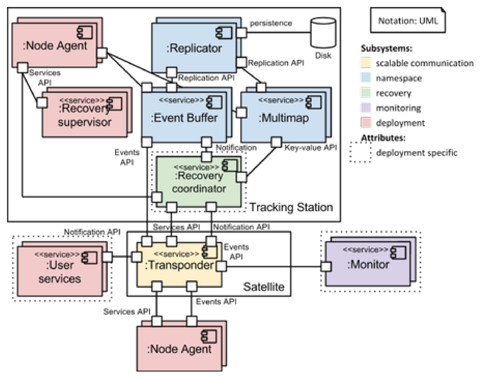

Communicating processes
=======================

Primary presentation
--------------------

Element catalog
---------------

Elements and their properties
~~~~~~~~~~~~~~~~~~~~~~~~~~~~~

Node Agent
++++++++++

**Functionality**: Each node participating in a cluster can host
any number of services. The node agent is a primitive entity assumed
to always be present on a node whose role is to accept incoming
requests to manipulate the set of services running on a node.
The node agent is not itself a service. The node agent has the
following responsibilities:

1) Accept incoming start/kill commands to alter the set of running
   services on the current node.
2) Restart failed services and notify the recovery coordinator of
   such an event.

A service instance may have any number of *parameters*, which are
themselves resources, attached to them. These parameters are typically
configuration files that may be different for each instance of a 
service. A start command always includes all parameters for a service.
A service should not depend on system specific state [1]_.

The node agent may or may not know about dependencies between services.
See `Variability guide`_ section below.

**Cardinality**: any number of instances.

Tracking Station
++++++++++++++++

**Functionality**: The recovery coordinator is the “brain” of Halon.
It sits in the tracking station, which is a set of nodes whose stateful
services are all replicated, so as to tolerate one or more node and 
communication failures.

It is essential that the state upon which the recovery coordinator depends
be available at all times, lest recovery action become impossible.
Therefore, the tracking station must be a very highly available abstraction.
Replicated state can only be updated by consensus of a majority of tracking
station replicas, so as to avoid “split brain” problems in case of
a network partition in the cluster.

In large clusters, nodes communicating directly with replicas could well
bring down all replicas under the excessive load generated by all
these requests. Likewise, notifying all nodes of recovery action is
best done in a distributed manner to minimize load and maximize usage
of the available bandwidth. For this reason, nodes do not normally
communicate directly with the tracking station, which employs a pool of
satellites to mediate communication.

There are as many nodes agents, replicators and recovery supervisors as
there are nodes in the tracking station. However, the recovery coordinator
only runs on one tracking station node at any one time. Otherwise,
every recovery action would be taken in duplicate.

**Cardinality**: a cluster normally has one tracking station.

Satellite
+++++++++

**Functionality**: A satellite is a stateless component whose sole purpose
is to facilitate scalable communication between the tracking station and
all other nodes in the cluster. See the Rationale section in
`architecture documentation index`_. Connections between the tracking station and
the transponder are called *uplinks*. Connections between the transponder
and worker nodes are called *downlinks*.

.. _architecture documentation index: ../index.html

**Cardinality**: any number of instances.

*Note on terminology*: in the VMS operating system, *satellites* were
computers without a local system disk. These nodes were usually pure
resource consumers. Here, we only call satellites nodes that have no
other function but to relay information - like in VMS, these satellite
nodes do not maintain any state for the cluster.

Transponder
+++++++++++

**Functionality**: The transponder is a service that runs on satellite nodes.
A transponder aggregates messages from downlinks and forwards the aggregate
messages down the uplinks. Conversely, a transponder breaks up aggregate
messages from uplinks, which represent batch communication jobs, and forwards
the individual messages to the specified destinations.

Aggregation of messages may involve filtering of redundant or spurious
messages. Aggregation policy is user configurable.

**Cardinality**: any number of instances.

Replicator
++++++++++

**Functionality**: The *resource graph* models all resources in the cluster
that are relevant for the purposes of recovery, as well as the relationships
between them. Resources may include:

1) the set of service instances on each node;
2) service parameters;
3) hardware resources, such as nodes and disks.

The (*resource graph*) *replicator* is a distributed service, formed of
synchronous services on 5 or more nodes. These services are just like
any other, managed by the respective node agents on each replica node.
As such, it may have any number of parameters associated with it.
Such parameters might include:

1) how many replicas of the namespace to run;
2) the group of nodes to run a replica on.

Because the resource graph is normally replicated, the tracking station
is resilient to up to :math:`\frac{N-1}{2}` replica failures.
The recovery coordinator uses the replicator at regular intervals to
checkpoint changes that it performs to all replicas. In this way, the
resource graph persists recovery coordinator failure. The replicator does
not just replicate the graph, but also incoming failure events submitted
by satellites (possibly via the transponder) using the Events API.

**Cardinality**: odd number of instances. Normally 5 instances distributed
across the cluster to avoid dependent failure. Supports more instances for
even higher availability but lower throughput.

Recovery coordinator
++++++++++++++++++++

**Functionality**: Application recovery is performed in response to any
failure event. The recovery coordinator coordinates this recovery. The
recovery coordinator should not maintain any non transient state of its
own, and depend entirely on the resource graph. It gets notified of
failures reported by monitors, carries out a recovery sequence in response
and dictates state changes in the resource graph accordingly.

Recovery coordinators are granted a lease. A recovery coordinator should
terminate when the lease runs out.

**Cardinality**: exactly one recovery coordinator.

Recovery supervisor
+++++++++++++++++++

**Functionality**: Recovery supervisors monitor the recovery coordinator.
The recovery coordinator is granted a lease to perform recovery actions.
The lease gets renewed every time the recovery coordinator flushes the
resource graph to disk. If the recovery coordinator’s lease runs out,
then the recovery supervisors elect a new node to run the recovery
coordinator on and instruct the relevant node agent to start a new
instance of the recovery coordinator. It is guaranteed that only one
coordinator runs at any time, because a new recovery coordinator will not
be started until the lease of the old recovery coordinator runs out and
terminates itself.

**Cardinality**: any number of instances.

User service (or application)
+++++++++++++++++++++++++++++

**Functionality**: An instance of a HAMS managed service. Services can be
started and killed.

**Cardinality**: any number of instances.

Monitors
++++++++

**Functionality**: Applications that monitor resources on a node, such as
hardware health, system services and HAMS managed services, and communicate
the monitoring data to the recovery coordinator by means of updates to the
resource graph.

Monitors may also be services that specialize in monitoring the health of
other nodes, say through sending regular heartbeats.

**Cardinality**: any number of instances.

Relations
~~~~~~~~~

Messaging between components
++++++++++++++++++++++++++++

Within a group, all components communicate with each other via asynchronous
message passing, over connections providing the required reliability and
order guarantees.

Managing services (not represented in primary presentation)
+++++++++++++++++++++++++++++++++++++++++++++++++++++++++++

All services on a particular node are managed by the node agent. This means
that it is the node agent that has the power to start and kill these services,
in response to external events such as commands from the recovery manager.

Element interfaces
~~~~~~~~~~~~~~~~~~

TODO

Element behaviour
~~~~~~~~~~~~~~~~~

TODO

Context diagram
---------------

TODO

Variability guide
-----------------

TODO: service dependencies?

Architecture background
-----------------------

Rationale
~~~~~~~~~

TODO

Analysis results
~~~~~~~~~~~~~~~~

N/A

Assumptions
~~~~~~~~~~~

None.

.. [1] In this way, services that don’t use persistent storage can be
       viewed as a pure (corecursive) function, whose arguments are
       the parameters.
