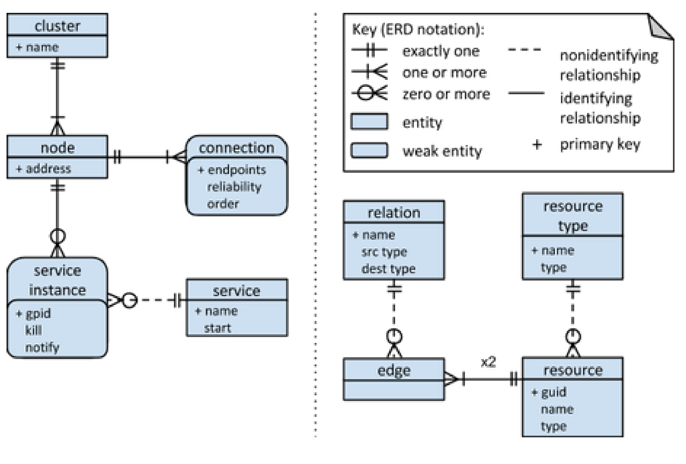

Data model
==========

Primary presentation
--------------------

Element catalog
---------------

Elements and their properties
~~~~~~~~~~~~~~~~~~~~~~~~~~~~~

This view, on the left hand side, is a logical data model. The elements
on the left hand side all appear in `layered abstract structures`_.
We focus here on the properties of each element and comment on the entity
relationship model.

.. _layered abstract structures: ../layered-abstract-structures/index.html

Furthermore, the right hand side introduces a meta-logical data model:
we model data entities, instances of which can be seen on the left hand
side, as *(typed) resources*. Resources are data entities with some added
structure, as will be explained below. In particular, all entities on the
left hand side are valid resources. Modelling entities in a cluster as
resources forms the basis of the namespace subsystem, which encodes
knowledge as a *resource graph*.

Resource type
+++++++++++++

A *resource type* classifies resources. A resource always has exactly one
resource type. A cluster will typically be modelled in the resource graph
using dozens of resources types.

Resource
++++++++

A *resource* is any data entity that has a primary key. This key is called
the *globally unique identifier (GUID)*. Resources are classified according
to their type. There will likely be many resources in a cluster, perhaps
about an order of magnitude more than the number of hardware components
modelled in the resource graph.

Relation
++++++++

A *relation* is the type of an edge. There will typically only be a handful
of relations.

Edge
++++

An *edge* between two resources is an element of a relation. That is, an edge
of type R between resources A and B expresses that A and B are related in R.
We expect resource graphs to be sparse, not dense, meaning that the number of
edges should be closer to the number :math:`N` of resources in the graph than to
:math:`N^2 \times \#R` where :math:`\#R` is the number of relations.

Cluster
+++++++

A *cluster* has a name, which uniquely identifies it. It is seldom useful to
represent the cluster as a resource explicitly. Clusters have names so as to
make a cluster itself a resource. There will usually only be one cluster,
though several clusters could conceivably be linked together and explicitly
represented as resources for administrative purposes.

Group
+++++

A *group* is not, strictly speaking an entity, but rather a set of entities,
i.e. a set of nodes. A group may be modelled as a resource by taking the
members of the group (or a hash of a list of members) to be the resource gid.
Example groups would the group of all worker nodes (running only user services),
the group of core HAMS nodes formed by the tracking station replicas and the
satellites. The number of groups in a cluster will typically be far less than
the number of nodes.

Node
++++

A *node* does not have any intrinsic properties associated with it beyond its
network address. Though some higher-level subsystems (see
`Subsystems layered view`_) might choose to
maintain additional information about a node as part of their state, e.g.
pertaining to various health metrics. HAMS-Cabal expects clusters to scale out
to up to 100K nodes.

.. _Subsystems layered view: ../subsystems-uses/index.html

Connection
++++++++++

*Connections* have two essential attributes: reliability and order. These
attributes together give rise to the following connection type matrix:

+---------------+--------------+----------------+
|               | **Reliable** | **Unreliable** |
+---------------+--------------+----------------+
| **Ordered**   | RO           |                |
+---------------+--------------+----------------+
| **Unordered** | RU           | UU             |
+---------------+--------------+----------------+

This model of connections corresponds to that of the CCI API [1]_.

A connection can be modelled as a resource by taking the pair of endpoints
to be the primary key.

Service
+++++++

A *service* features a name and a command to instantiate a new instance.
There may be in the order a few dozen different services in a cluster.

Service instance
++++++++++++++++

A service can be started any number of times, each time yielding a new
*service instance*. A service instance is to a service what a process is to
a binary, in UNIX parlance. A service instance can be notified an arbitrary
message (akin to a signal in POSIX), as well as killed. It is implementation
defined what killing a service actually means - clean shutdown, forcible
shutdown, etc. The one contract that the kill function of a service instance
must respect is that upon return, all processes that together made up the
service instance no longer exist.

Context diagram
---------------

TODO

Variability guide
-----------------

TODO: RDF?

Architecture background
-----------------------

Rationale
~~~~~~~~~

Analysis results
~~~~~~~~~~~~~~~~

Assumptions
~~~~~~~~~~~

.. [1] Atchley, Scott, et al. `The common communication interface (CCI)`_,
	   *High Performance Interconnects (HOTI), 2011 IEEE 19th Annual Symposium
	   on.* IEEE, 2011.

.. _The common communication interface (CCI): http://www.olcf.ornl.gov/wp-content/uploads/2011/06/HotI2011-CCI.pdf
