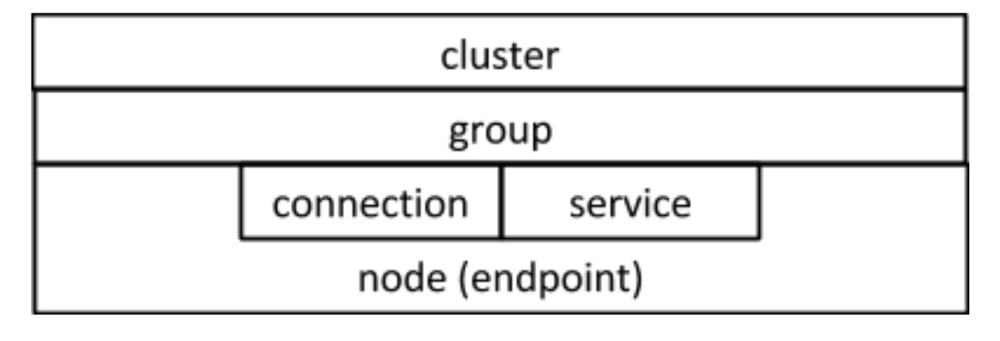

View: Layered abstract structures
=================================

Primary presentation
--------------------

Element catalog
---------------

Elements and their properties
~~~~~~~~~~~~~~~~~~~~~~~~~~~~~

Node (endpoint)
+++++++++++++++

A *node* is a virtualized instance of an addressable network device.
In the context of communication, we sometimes call nodes *endpoints*.

Connection
++++++++++

A *connection* represents the state of a unidirectional communication
channel between two endpoints. An endpoint can be connected to another
endpoint through at most one connection.

Process
+++++++

A *process* is an instance of a program. If a connection exists between
two nodes hosting two processes, then one process can send a message to
the other process.

Service
+++++++

Some processes can be started, stopped and queried for their status.
These processes are called *services*.

Group
+++++

A *group* G is a set of processes. A *view* is a subset of G. The processes
of a view are called *ingress processes*. A group in and of itself has no
identity on the network and therefore cannot be addressed. However, one can
form a *port of entry* provided a view of the group, i.e. a set of ingress
processes. A port of entry is a process - one can send messages to it as to
any other process. These messages will be forwarded to one or more ingress
processes.

Groups can be classified according to their routing scheme:

1) *manycast*: ingress processes forward the message to *k* processes among
   the *n* processes in the group.
2) *unicast*: a special case of manycast where *k = 1*.
3) *multicast*: a special case of manycast where *k = n*.

Cluster
+++++++

The *cluster* is the set of all nodes across which groups may be formed.

Relations
~~~~~~~~~

N/A

Element interfaces
~~~~~~~~~~~~~~~~~~

N/A

Element behaviour
~~~~~~~~~~~~~~~~~

N/A

Context diagram
---------------

TODO

Variability guide
-----------------

N/A

Architecture background
-----------------------

Rationale
~~~~~~~~~

TODO

Analysis results
~~~~~~~~~~~~~~~~

N/A

Assumptions
~~~~~~~~~~~

N/A

Related view packets
--------------------

See :doc:`../data-model/index`.

