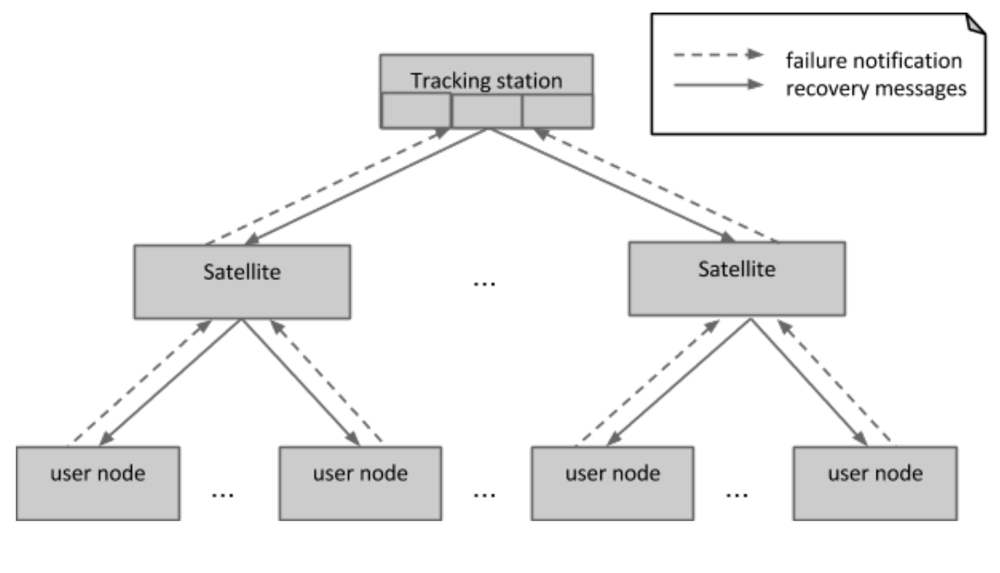

Scalable tree communication deployment
======================================

Primary presentation
--------------------

Element catalog
---------------

Elements and their properties
~~~~~~~~~~~~~~~~~~~~~~~~~~~~~

Tracking station
++++++++++++++++

The tracking station isn’t strictly speaking a node, but rather a
set of nodes whose non-transient state is replicated.

**Services**: each node of the tracking station runs one recovery
supervisor, as well as one replica of the resource graph. One of
the nodes of the tracking station moreover run the recovery manager.

**Number of nodes**: A tracking station consists of a fixed number
of replicas. The set of nodes making up the tracking station does not
change, except temporarily, between the moment a node permanently 
fails and has its hardware replaced, or between the moment a transient
network failure occurs and when communication is reestablished. Only a
quorum of nodes able to achieve consensus are considered part of the
tracking station.

Satellite
+++++++++

**Services**: transponder service.

**Number of nodes**: It is expected that a satellite will be required
for every 1000 nodes in the cluster.

User node
+++++++++

**Services**: any deployment specific services whose availability is
the responsibility of Halon.

**Number of nodes**: anywhere from a handful of nodes to 100K.

Relations
~~~~~~~~~

N/A

Element interfaces
~~~~~~~~~~~~~~~~~~

N/A

Element behaviour
~~~~~~~~~~~~~~~~~

N/A

Context diagram
---------------

N/A

Variability guide
-----------------

N/A

Architecture background
-----------------------

Rationale
~~~~~~~~~

In a cluster with very many nodes, there will be a great many monitors
checking the liveness of many nodes and services. The monitors should
overlap in the set of nodes and services that are under their purview.
In this way, node failure will still be reported in the event that a
monitor fails or gets disconnected from the rest of the cluster. However,
deploying monitors in this way will invariably lead to many duplicate
failure reports, perhaps even thousands. While a handful of duplicate
reports is tolerable, a great many reports about essentially the same
failure can have a great impact on the load of the tracking station.

Furthermore, it may be desirable to collect failure reports and run an
analysis on the aggregated failure reports, so as to increase the accuracy
of the failure reports, say by requiring that a certain threshold of number
of reports for the same failure be met before the failure is deemed likely
enough that the recovery manager in the tracking station should be made
aware of it and undertake corrective action.

Finally, the bandwidth available to the recovery monitor may cause
clusterwide communication that may be necessary as part of recovery to be
slower than it might otherwise be if more resources were put to use in
parallel.

We address these three observations by introducing satellite nodes to
mediate communication between the tracking station and the other nodes in
the cluster. The satellite nodes and tracking station are collected into
one manycast group, so that the existence of these mediating satellites is
transparent to the nodes that have failures to report. Nodes send messages
to the group, through a port of entry, without worrying about how, or
indeed if (in case of report filtering), the report will make it to the 
tracking station.

One should view satellites as a pool of available nodes to delegate batch
communication jobs to, much in the same way as a Map/Reduce framework.
Satellites are not configured with a fixed set of nodes that they must
broadcast uplink messages to. Instead, any satellite can be used to
communicate to any set of destination nodes listed as destinations of an
uplink message. In this manner, no static tree topology has to be
maintained - and amended upon failure of a satellite. Instead, the
tree-like structure of the downward flow of information is completely
dynamic.

Analysis results
~~~~~~~~~~~~~~~~

N/A

Assumptions
~~~~~~~~~~~

N/A

