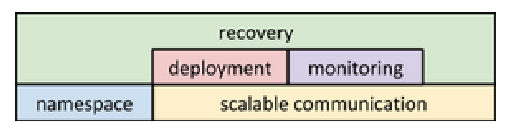

Subsystems uses
===============

Primary presentation
--------------------

Element catalog
---------------

Elements and their properties
~~~~~~~~~~~~~~~~~~~~~~~~~~~~~

Scalable communication
++++++++++++++++++++++

This subsystem concerns itself with establishing communication
channels between nodes, monitoring the status of these channels,
reestablishing channels if necessary and neighbour node discovery.

Namespace
+++++++++

The *namespace* allows groups to advertize their services. The
namespace is also instrumental in coordinating failover during
recovery.

Deployment
++++++++++

The deployment subsystem is that which concerns itself with
effectuating the orders received during recovery.
See :doc:`../communicating-processes/index` for possible orders.

Monitoring
++++++++++

The core function of Halon is to recover from failures.
The *monitoring subsystem* concerns itself with detecting them.
This is achieved through deploying a set of core Halon monitors,
which is typically augmented with deployment specific, user provided
monitors.

Recovery
++++++++

The *recovery subsystem* concerns itself with managing the resources
in the cluster. It is the recovery subsystem that coordinates corrective
action in response to any failure in the cluster.

Relations
~~~~~~~~~

Element interfaces
~~~~~~~~~~~~~~~~~~

Element behaviour
~~~~~~~~~~~~~~~~~

Context diagram
---------------

.. figure:: fig2.png
   :width: 60%
   :align: center

Halon sits atop the networking components of the cluster to
provide interconnect between nodes, layering a mechanism for scalable
communication on top. Halon manages user services, but the user
services do not interact with Halon in anyway, except user supplied
monitors, which interact with the HAMS using the monitoring API.

Variability guide
-----------------

N/A

Architecture background
-----------------------

Rationale
~~~~~~~~~

Analysis results
~~~~~~~~~~~~~~~~

Assumptions
~~~~~~~~~~~
