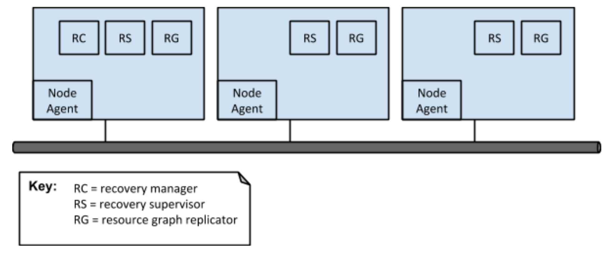
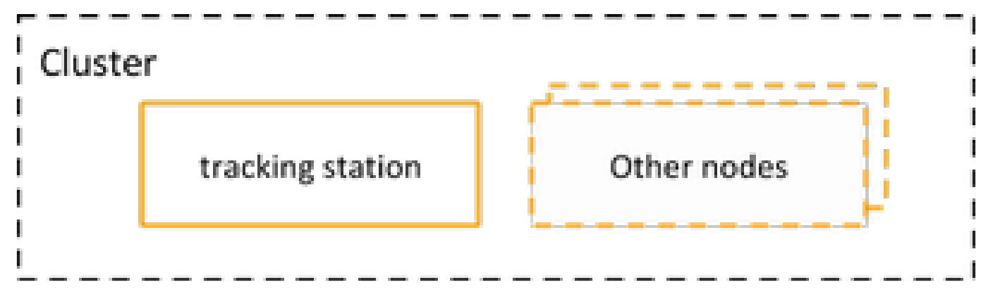

View: Tracking station deployment
=================================

Primary presentation
--------------------

For clarity of exposition, the above diagram depicts the tracking
station as being made of three replicas. In practice, the tracking
station will typically have 5 replicas, so as to support up to
2 concurrent failures.

Element catalog
---------------

Elements and their properties
~~~~~~~~~~~~~~~~~~~~~~~~~~~~~

See corresponding section in the `Components and connectors view`_.

Element interfaces
~~~~~~~~~~~~~~~~~~

See corresponding section in the `Components and connectors view`_.

Element behaviour
~~~~~~~~~~~~~~~~~

See corresponding section in the `Components and connectors view`_.

Context diagram
---------------

Variability guide
-----------------

The tracking station may have any number of replicas. A higher number
of replicas marginally increases availability but reduces throughput.
The number of replicas in a tracking station should be an odd number,
so as to avoid more than one connected set of nodes being quorate in
the event of a network partition.

Architecture background
-----------------------

Rationale
~~~~~~~~~

N/A

Analysis results
~~~~~~~~~~~~~~~~

N/A

Assumptions
~~~~~~~~~~~

N/A

.. _Components and connectors view: /TODO
