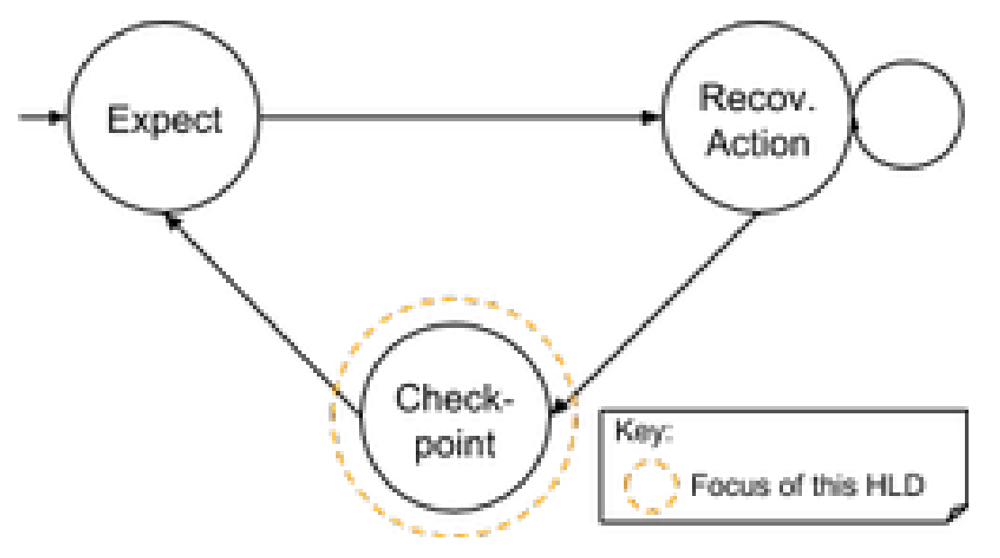
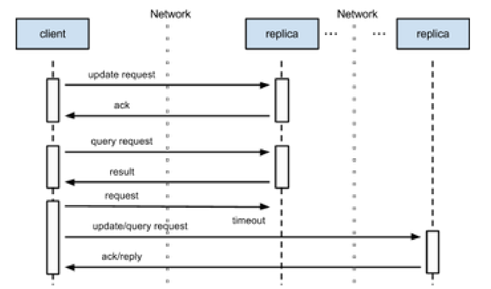
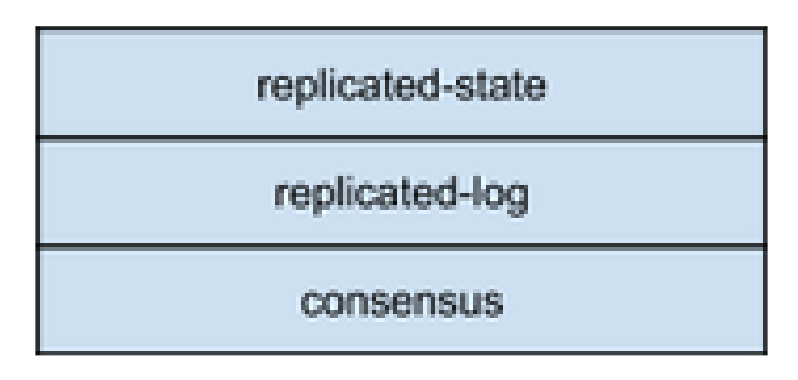
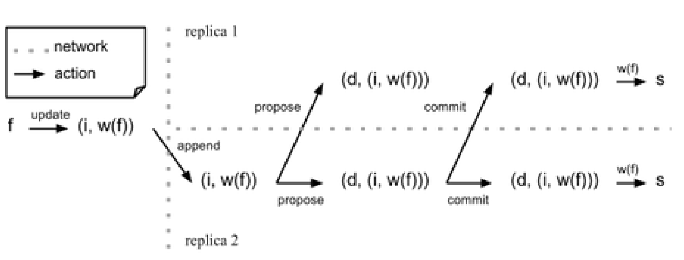
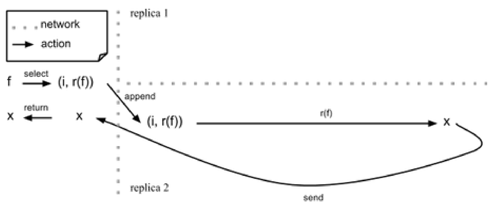
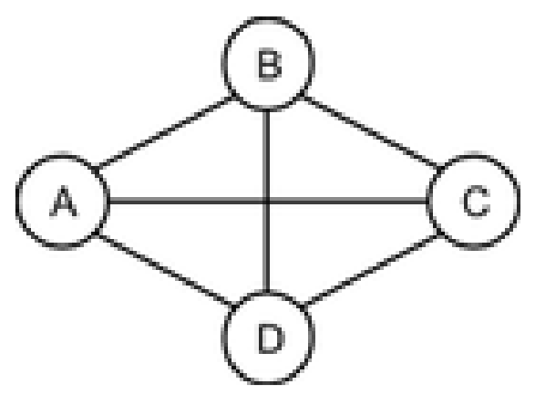
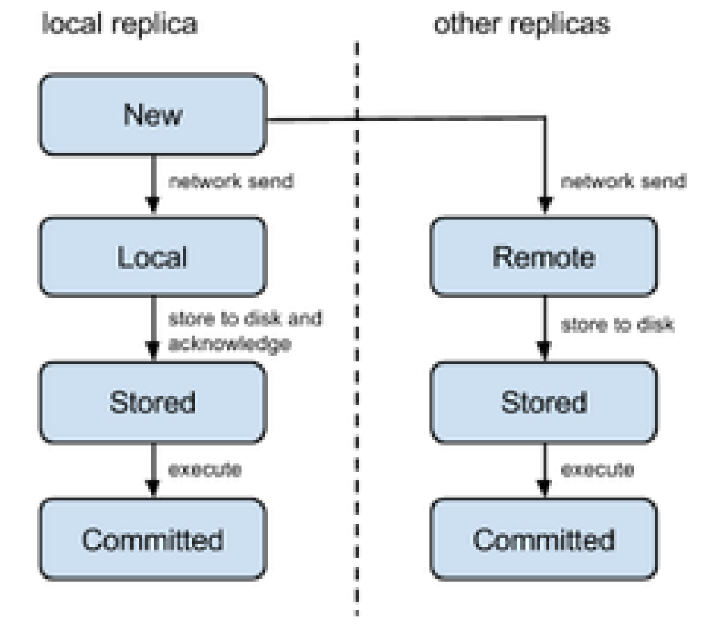

High-level design: Replication subsystem
========================================

Introduction
------------

High-availability of the cluster depends crucially on the
high-availability of the tracking station. Failures cannot be recovered
in a timely manner if the tracking station is not available. Our
strategy to make the tracking station highly available is to replicate
the internal state of the tracking station on multiple nodes spread
around the cluster. The RC itself is not replicated, since the RC is the
entity that actually performs the recovery actions, and while
idempotent, actions should preferably be performed only once rather than
in duplicate, for efficiency’s sake. Each node contains one full copy of
enough state that if the node hosting the RC fails, then the RC can be
started atop a new replica and resume where it left off from the last
checkpoint.

For simplicity, currently the RC checkpoints its internal state exactly
once per cluster failure event. The cluster responds to a cluster
failure event one at a time by taking a sequence of actions, and in so
doing changes its own internal state. Once the recovery of the failure
event is deemed complete, the RC checkpoints its state and repeats the
cycle with the next failure event.

State checkpointing involves broadcasting all changes compared to the
previous checkpoint to all replicas. However, one particular difficulty
here is that the state of all replicas must be kept consistent at all
times, so that restarting the RC on any one replica would yield the
exact same behaviour from the RC given the exact same cluster failure
event. The consistency of the state of all replicas must be maintained
even as some or all of the replicas may fail.

The distributed algorithm we chose to broadcast state updates, all the
while maintaining this state consistent, is Multi-Paxos, a consensus
algorithm. This document briefly presents the algorithm and how we use
it.

The system under consideration here is the replication subsystem of HA.
The actors exerting stimuli on the system are clients of this subsystem,
be they other components of the tracking station or satellite nodes.

Definitions
-----------

(Replication) Group
    a set of nodes across which replicated state is maintained.
Replication subsystem
    provides interfaces to maintain state replicated among the nodes of
    a replication group. The group across which state is replicated may
    change over time. The replication subsystem allows for any node in
    the group as well as outside nodes to query the current state. It
    also provides operations to update the state in a manner that
    guarantees consistency.
Query
    an action that does not change system state.
Reconfiguration
    changing the metadata associated to the replication group, chiefly
    the membership of the group (e.g. adding a new replica, deleting an
    existing replica).
Consistency
    an entity is consistent if the result of any action on the entity is
    the same no matter which node in the replication group the action is
    sent to. In particular, if a state update is sent to one node by a
    client, the update acknowledged to the client, then a query
    subsequently sent by the client will always return the same result.
Liveness
    the ability of the replication subsystem to update or query the
    replicated state while keeping it consistent.
Stability
    a datum is stable when replication guarantees that the datum will
    remain accessible after any allowed failure (see below).
Crash
    a node is said to be in a crashed state if its state can no longer
    change.
Corruption
    a node is said to be in a corrupted state if it is crashed and it
    state can no longer be recovered. In the absence of persistent
    storage, a node is crashed iff it is corrupted.
Quorum
    TODO
Allowed failures (no persistence)
    a failure that does not affect consistency or stability:

    -  Transient network failures (message loss, message duplication,
       message reordering);
    -  Up to :math:`N-1` nodes in the group being in a crashed state,
       where :math:`N` is the number of nodes in a group. Note that
       liveness can only be ensured if at most
       :math:`\lfloor(N-1) \div 2\rfloor` nodes are in a crashed state.

Allowed failures (with persistence)
    a failure that does not affect consistency or stability provided
    that nodes have a persistent storage available:

    -  All of the failures that are allowed in the absence of
       persistence;
    -  Up to :math:`N` nodes in the group being in a crashed state;
    -  Up to :math:`\lfloor (N-1) \div 2\rfloor` nodes in the group
       being in a corrupted state. The shared state of a group can still
       be recovered when up to :math:`N-1` nodes are corrupted, but in
       that case stability is not guaranteed, unless quorum is always
       taken to be the entire group (see “Quorum” above).

Replication factor
    the average number of copies over time of a given datum being stored
    in a group.

Requirements
------------

-  **[R.RL.GROUP.RECONF]** It must be possible to reconfigure a
   replication group. Group reconfiguration does not happen in response
   to network splits (see below). However, in response to a hardware
   failure or policy change, the operator may decide to update the group
   membership list, in particular to avoid replicas making futile
   attempts to contact a node that has permanently failed or that is no
   longer supposed to be part of the Tracking Station.

-  **[R.RL.READ]** Queries about the replicated state from nodes inside
   and outside of the group are supported.

-  **[R.RL.READ.CONSISTENT]** Results sent to nodes outside of the group
   are consistent.

-  **[R.RL.READ.ANYWHERE]** A client can submit a query to any replica
   of the group.

-  **[R.RL.WRITE]** The replicated state can be updated by a client
   process living on a node inside or outside of the group.

-  **[R.RL.WRITE.RESILIENT]** A write that is acknowledged to the client
   will not get lost even in the face of allowed failures (see above).

-  **[R.RL.LEADER.NOTIFY]** A client can be told to use one of the
   replicas in preference to others for better performance.

-  **[R.RL.CATCH-UP]** The replication subsystem is able to make
   progress so long as a quorum of nodes are correct and respond to the
   replica that is coordinating update requests and read requests. Slow
   or temporarily disconnected replicas are able to catch up at a later
   time on transactions that were successfully committed in their
   absence.

-  **[R.RL.CATCH-UP.BOUND]** In the name of space efficiency, a bound on
   how far behind a replica can fall is permitted. Resource usage other
   than the replicated state is bounded.

-  **[R.RL.SNAPSHOT]** When a new replica gets added, or when a slow
   replica cannot catch up, it is able to copy a recent snapshot of the
   replicated state, from which point it can catch up per the previous
   requirement.

-  **[R.RL.DUP]** Duplicate requests from a client are ignored.

-  **[R.RL.DUP.BOUND]** The state required to detect duplicates is
   bounded in size.

Quality attributes
------------------

The relevant quality attributes are:

-  Correctness
-  Reliability
-  Maintainability
-  Performance

Quality attribute scenarios (QAS)
---------------------------------

See “Quality Attribute Scenarios: HA”.

Design highlights
-----------------

The design exhibits the following properties:

-  The low-level consensus algorithm implementation is made separate and
   abstracted away behind a simple interface from higher level
   mechanisms required for replication, such as group membership changes
   and keeping a log of transactions so that slow nodes can catch up.
   This allows us to swap out the consensus algorithm for a completely
   different one, and experiment with various implementations, from
   basic to optimized.

-  Implementations of consensus are packaged independently and can be
   reused in different contexts, without the extra transaction logging
   machinery we build on top, or with a different one.

-  The low-level interface for consensus algorithms is general and
   simple enough to use other models than consensus at the lowest layer
   with various levels of correctness, liveness guarantees and
   performance characteristics, e.g. atomic commit and virtual
   synchrony.

-  We optimize for clarity and conciseness of the code rather than
   performance.

-  Communication between entities is fully asynchronous (no RPC
   semantics).

-  Agreement on group configuration is obtained by reusing the
   replicated state machinery. In other words, rather than implementing
   reconfiguration as a primitive of the low-level consensus algorithms,
   reconfiguration is implemented on top, in terms of the said consensus
   algorithms.

Functional specification
------------------------

Client-replica interaction
~~~~~~~~~~~~~~~~~~~~~~~~~~

Replicas interact with a client, who send requests of arbitrary nature
to one of the replicas in a replication group. In general, a client may
be co-located with the replica or located on a distant node.

For performance reasons, replicas classify these requests as updates or
queries (any request that is known not to modify the state). Replicas
perform instance specific actions in response to client requests,
including but not limited to state transitions and sending messages to
arbitrary recipients on the network.

   of replicas

   Sequence diagram of the interaction between a client and a set of
   replicas

A client is normally aware of several of the replicas. In this way, if
sending a request to one replica is deemed by the client to have failed
(due e.g. to not getting a reply before timeout), then the client can
resend this request to another replica. It is up to the client of the
replicatedlog layer to uniquely identify each request if the effect of
each request is not idempotent.

Failure model
~~~~~~~~~~~~~

We assume a non-Byzantine failure model. Replicas are either correct or
do not interact with the other replicas and with clients. Replicas may
fail at any moment. We assume a failrecover model: any replica that has
crashed can potentially be restarted and, possibly after an
initialization phase, recover. Messages between processes can be lost,
duplicated or reordered.

Quorum
~~~~~~

A *quorum* of replicas is any subset of the replica group. Normally,
quorums are subject to the constraint that they be at least of size
:math:`\lceil(N+1)\div 2\rceil`, where :math:`N` is the size of the
group. That is, a quorum is a majority of nodes. However, see “Node
failure” for a modified definition. Also, the user may choose to
restrict quorum size to be exactly :math:`N`, e.g. to maximize the
replication factor. Maximizing the replication factor is useful to
guarantee stability even in the face of :math:`N-1` corrupt nodes.

Voting
~~~~~~

Every member of the replica group contributes to quorum. However,
following a crash, a replica can no longer make good on promises that it
may have done to other replicas as part of the consensus algorithm.
Paxos in particular requires that replicas acting in an “acceptor”
capacity do not respond to proposers advertizing a lower ballot number
than they have previously responded to. In the absence of persistent
storage, a replica that recovers from a crash cannot remember what
proposers it has responded to in the past. Thus, in this case, a
recovering replica must be considered a new replica.

Consensus
~~~~~~~~~

Quoting from “Paxos made simple”:

    Assume a collection of processes that can propose values. A
    consensus algorithm ensures that a single one among the proposed
    values is chosen. If no value is proposed, then no value should be
    chosen. If a value has been chosen, then processes should be able to
    learn the chosen value.

The processes in question here are replicas. The values they propose are
client requests. In general multiple client requests are sent to the
replicas, so replicas perform multiple instances of consensus.

Persistence
~~~~~~~~~~~

Multi-Paxos can continue to make progress (accept new state changes)
even in the face of a minority of replicas failing. However, if more
replicas fail, then liveness is compromised, because no one knows where
the algorithm last left off. To solve this, Paxos implementations
usually make writes to disk at various stages of the algorithm, so that
when a majority of replicas come back online, they may resume with the
algorithm.

The replicated log of requests
~~~~~~~~~~~~~~~~~~~~~~~~~~~~~~

The main abstraction exported by the Replication Subsystem is a
replicated log of requests. This log is mainly used to record the
mutually agreed ordering of all requests incoming at all replica sites.
The log is also used by slow replicas to catch up on requests that were
agreed upon without its assent [1]_. A log is defined as follows:

(Replicated) Request log
    abstractly speaking, a request log is a partial function
    :math:`\mathds{N} \to \mathit{Req}` where :math:`\mathds{N}` is the
    set of natural numbers and :math:`\mathit{Req}` is the set of all
    possible requests. We define the following operations on the graph
    of a log:

    -  :math:`\mathrm{append}(L,i,\mathit{req}) = L \cup \{(i, \mathit{req})\} \text{ if } i\not\in \mathrm{dom}(L)`.

    The set :math:`\mathds{N}` is also called the set of *slots* of the
    log.

Request stream
~~~~~~~~~~~~~~

The replicated request log is a distributed abstraction --- at runtime a
log is supported by a number of processes running at each replica site.
This log can be appended to at any time by any client concurrently. By
contrast, a request stream is a local abstraction capturing the sequence
of requests sent by a single client to the log.

Whereas the replicated log is an external abstraction of the replication
group, the request stream is an abstraction internal to one particular
client.

Logical specification
---------------------

Layered subsystem view
~~~~~~~~~~~~~~~~~~~~~~

The Replication Subsystem is subdivided into three layers:

1. **consensus**: the lowest layer provides mechanisms for replicas to
   propose a given request for a given slot in the log, and ensure that
   all other replicas agree to the same value for the given slot. The
   consensus layer has a notion of decree. A decree is the result of one
   instance of consensus and is identified by a decree identifier. All
   decrees have a value. The consensus layer allows all replicas to
   agree on the value of a slot by passing a decree with the given
   request as the decree value.

2. **replicated-log**: this layer keeps track of the history of decrees
   that were passed through consensus, in a generic way. It does not
   depend on any internal detail of the particular consensus
   implementation that it is paired with. And indeed one implementation
   can seamlessly be swapped out for another.

3. **replicated-state**: the log makes no assumption about the values it
   receives, proposes for consensus, and records. In practice, however,
   values sent to the log by a client are commands that modify a single
   state variable in a sequential way. These commands are totally
   ordered by sequence number. This layer exports functionality to help
   a client assign globally unique sequence numbers to each request that
   it submits to the log. It also exports a simple state API, consisting
   of functions to query the current replicated state and functions to
   update it.

Note that while replicated-state sequences all commands from one client
(by sequence number), replicated-log sequences all commands from all
clients (by decree identifier). If commands are idempotent, then a
client does not need to use the replicated-state layer, instead
interfacing with replicated-log directly.

Interfaces
----------

This section describes the signatures of the modules presented above. It
is left to the DLD whether a given signature maps to a type class, a
record, or a set of top-level declarations.

We assume an abstract type ``Action a`` of actions (expression having a
side-effect when evaluated) that return a value of type a, without
specifying how actions are implemented.

consensus
~~~~~~~~~

.. code:: haskell

    type DecreeId

    type Propose s a

    signature Protocol (type a) =
        type s

        acceptor :: Process ()
        propose :: DecreeId → a → Propose s a
    end Protocol

A consensus protocol is characterized by two essential elements:

1. the actions of the acceptor processes;
2. an action of proposing decrees.

A protocol can require that state be maintained between proposals. This
state can be used for example to optimize proposals from a replica using
Paxos that has previously won a proposal --- in this case the replica
does not need to go through the election phase of Paxos. This state is
internal and specific to the particular consensus protocol.

The ``Propose s a`` type is the type of actions returning a value of
type ``a`` given the state of type ``s``.

replicated-log
~~~~~~~~~~~~~~

.. code:: haskell

    signature Log
        initialize :: Action s
        nextState :: s → a → Action s
    end Log

    signature replicated-log (P : Protocol) (L : Log)
        type Hint = None | Idempotent | Nullipotent

        type Handle

        type NominationPolicy

        new :: [NodeId] → Action Handle

        finalize :: Handle → Action ()

        colonize :: NodeId → Handle → Action ()
        reconfigure :: NominationPolicy → Handle → Action ()

        append :: Handle → Hint → a → Action ()

        type RemoteHandle

        remoteHandle :: Handle → RemoteHandle
        dup :: RemoteHandle → Handle
    end replicated-log

A structure implementing the ``Log`` interface provides callbacks for
each of:

1. replicated log creation, to set the initial state of the state
   machine;
2. the action to be executed when a request gets recorded in the
   replicated log, making the state machine transition to a new state.

A replicated log is parameterized by the consensus protocol and the set
of callbacks given in a ``Log`` structure. The action ``new`` will
create a new replicated log by spawning a replica process at each
replica site node. This action returns a handle, which is an abstract
datatype that can be used to address a replicated log. This action need
not be atomic, in that not all nodes are live at the time it is
performed, then it is fine to spawn replicas on some of the provided
nodes but not all of of them, so long as the quorum still counts all
nodes. ``finalize`` deallocates any resources allocated by ``new``.

Logs support operations upon them, acting on either on the log metadata
(membership) or data (adding an entry to the the log).

A group can be reconfigured with a different membership using the
``reconfigure`` action. This action takes a nomination policy as
argument, which is a function yielding a new membership list given the
existing one. Example nomination policies include filtering out all
replicas on any given node, or overriding the current membership with a
completely new membership disjoint from the current one. ``colonize`` is
used to spawn a new replica on a new node.

The only data operation supported by replicated logs is ``append``,
which records a new entry to the log. The first argument of this
function is a handle to a replicated log. For performance reasons, the
client can include a hint indicating whether the new entry being added
to the log is idempotent or nullipotent (i.e. has no effect on the
replicated state, which is the case for all read requests). Nullipotent
operations can be added to the log more efficiently than other
operations, or in fact omitted from the log altogether.

Calling ``append`` after ``finalize`` on a handle yields a runtime
error.

A handle is intentionally not serializable and kept completely abstract
--- as such it cannot be communicated across a network. A handle is
therefore only useful on the node on which it was created. However,
other clients must be able to address the replicated log too. While we
do not allow sharing handles between nodes, it is possible to “clone” a
handle on other clients so as to be able to address the same replicated
log. Cloning a handle is a two-step process: one must first create a
``RemoteHandle`` from a ``Handle``. A ``RemoteHandle`` represents a
handle on a remote node. It is serializable, but cannot be used to
address a replicated log directly - one must create a new handle from
the remote handle first. This is what the ``dup`` action [2]_ does.

replicated-state
~~~~~~~~~~~~~~~~

.. code:: haskell

    type CommandPort s

    connect :: Handle → Action (CommandPort s)

    select :: CommandPort s → (s → Action a) → Action a
    update :: CommandPort s → (s → Action s) → Action ()

In general most clients send commands that are not necessarily
idempotent. What’s more, clients manipulate replicated state much in the
manner of a database --- executing queries to read *part of* the state
and sending commands to update the state in arbitrary ways. A command
port allows for a *stream* of queries and updates to be sent from the
client. A single client can in principle open multiple command ports,
though the implementation is allowed to restrict command ports to only
one command port per process.

One creates a new command port through the ``connect`` action [3]_.
There is no corresponding disconnect action --- resources associated
with command ports are naturally recycled by the garbage collector.

For full generality, both queries and state manipulation actions are
parameterized by arbitrary functions executed on the replicas. In the
case of ``select``, the provided function is a *state projection*
function. In the case of ``update``, the function is a *state
transition* function.

Summary of communication flow
-----------------------------

The following diagrams summarize the flow of various requests according
to the design described above. For simplicity, we illustrate the flow
when only two replicas are present, but in general there may be any
number of replicas.

Write requests
~~~~~~~~~~~~~~

A request identified as ``i`` sent to a replica using the ``update``
action is considered a write request and can modify the replicated state
in arbitrary ways. Like all requests, it gets tagged with a globally
unique request identifier. Appending such a request to the replicated
log involves forwarding the request to one of the replicas, then waiting
for that replica to successfully propose the request as the ``d``-th
value in the replicated log through consensus. At this point the update
request is complete and a new request can be sent. Asynchronously, the
proposed value gets committed to all replicas of the log and the write
callback ``f`` gets executed. When using replicated-state, the write
callback simply consists in calling the proposed value (i.e. the value
of the decree). The value of the decree is itself an action, which when
called yields ``s``, the new state of the state machine associated to
the replicated log.

``w``, is a wrapper function around ``f`` internal to ``update``.

Read requests
~~~~~~~~~~~~~

A request sent to a replica using ``select`` is a special case. Because
such a request is known to have no effect on the state, the replicated
log can be completely oblivious to it and it does not need to be
submitted for consensus. Therefore, only one replica need be involved in
serving read requests. However, in order to maintain the consistency
requirements stated in the Requirements section, the replica must ensure
that it is up-to-date, i.e. that there are no entries in the replicated
log recorded at other replicas that can be caught up upon. To do this
without consensus for each read request requires obtaining a lease,
through consensus (see “Optimizations” below). This is faster because
consensus is required only once per lease, as opposed to once per read
request.

``r`` is a wrapper around ``f`` internal to ``select``, which sends the
projection of the replicated state computed by ``f`` back to the calling
process.

State
=====

Consensus
---------

Consensus implementation: Multi-paxos
~~~~~~~~~~~~~~~~~~~~~~~~~~~~~~~~~~~~~

We make no attempt here to describe the Paxos protocol and its variants
in full detail. This is by now a well understood algorithm that is well
documented in the literature. See the References section for pointers
particularly relevant for an implementation. We do explain the different
roles in Paxos and how they interact.

The Paxos algorithm segregates processes into a number of roles. Since
the names of each of these roles differ in the literature, we review
them here:

-  **clients**: these are the processes that are asking for state
   changes to be made.
-  **proposers**: the processes that propose state changes on behalf of
   clients. Clients do not propose changes directly because clients do
   not participate in the distributed consensus algorithm. In fact they
   should be oblivious to its very existence.
-  **acceptors**: these are the passive agents, which never make any
   proposals of their own but remember proposals of concurrent
   proposers.
-  **ambassador**: an ambassador is a process on a client node that
   abstracts away the fact that there are many replicas each running one
   or more acceptors and/or proposers. Any message sent to an ambassador
   is non-deterministically forwarded to one or more proposers. In this
   manner, to the client, the group of replicas looks like it *is* one
   single process, to which one can *send* messages. An ambassador is
   local to a client node. Each node has its own ambassador that it does
   not share with other nodes.

This design maps acceptors to separate processes and proposers to
replica processes.

On a client node, the ambassador is the handle to the replicated log.

Optimizations
~~~~~~~~~~~~~

In practice, each replica consists of exactly one proposer and one
acceptor. In Basic Paxos, all replicas are thus symmetric. However,
Basic Paxos requires 3 roundtrips to get all replicas to agree on each
state change. The algorithm is nonetheless optimal, if one considers
only single instance of the algorithm. In practice, one runs many
instances of the algorithm: one for each checkpoint. When the Basic
Paxos algorithm is iterated in this way, the first phase of the
algorithm, the “prepare” phase, can be skipped, by assuming that one of
the proposers is a distinguished proposer, called a *master* or
*leader*. If the leader dies, then other proposers should notice that
and one proposer will become a leader, through one instance of Basic
Paxos. This optimized, iterated Paxos is called Multi-Paxos.

Further optimizations can be brought about by granting the leader a
lease (short, usually in the order of about 10 seconds max), and asking
all the clients to only talk to the leader, or at least that all other
replicas forward requests from clients to the leader. In this way, read
requests can be made even more efficient, because since a leader is
granted a lease it means that for a certain given amount of time it is
guaranteed that no other leader will ever pop up anywhere in the
network, and so whatever state is stored as the latest state on the
leader really must be the latest state stored on every other replica.
Therefore, read requests can be served entirely from the leader, without
having to contact all the other replicas. It is *not* crucial to
implement this optimization, since in our case the only reader is the RC
and the recovery supervisors, the RC very seldom reads the state from
the replicator (typically only at startup, following a failure of a
previous instance of the RC), and the recovery supervisors attempt to
read the state once every few seconds.

Liveness
~~~~~~~~

The FLP impossibility theorem says that in the presence of one failing
process, no consensus algorithm between sets of processes that
communicate asynchronously terminates in every case. This means that a
single instance of Paxos could go on forever. This is a largely academic
result, however. This impossibility result assumes that messages can be
delayed arbitrarily. But in practice, no system is truly asynchronous,
in that there always exists an upper bound on just how long a message
can take to arrive to destination. Or rather, one can define to be lost
a message that takes longer than a given timeout to arrive to
destination.

Default Paxos can get stuck forever in a chain of competing proposers
vying for their proposal to get accepted by a majority. But this problem
can be solved in practice by using adaptive timeouts[^4], by further
assuming that clock drift on nodes is also bounded.

[^4:] See Section 3 of “Paxos made moderately complex”.

Replicated log
--------------

Messages between replicas
~~~~~~~~~~~~~~~~~~~~~~~~~

Replicas exchange the following messages among each other:

-  **Commit**: a commit message from a source replica to all other
   replicas signal that the replica has successfully passed a decree
   through consensus. This means that a given slot in the log now has a
   value.
-  **Query**: replicas can occasionally miss Commit messages or these
   messages can be delayed. Upon noticing that it is lagging (see
   below), a replica sends one Query message for every log slot for
   which it does not know the value. The list of slots to query is the
   following set:
   :math:`\{d' | \forall d'\in N, d'<d \wedge L(d) \text{ undefined}\}`.

-  **Max**: when a replica crashes and subsequently recovers, it cannot
   participate in quorums for consensus because it is does not remember
   what promises it has made in the past to proposers. Therefore,
   immediately following recovery and before recovering voting rights, a
   replica must determine the supremum of the set of decree numbers for
   which proposals have been made. It does this by sending Max messages
   to a quorum of other replicas. The replica shall only participate in
   quorums for passing decrees whose numbers are higher than this
   supremum.

Committing a log entry
~~~~~~~~~~~~~~~~~~~~~~

A commit entails atomically adding a new entry to each replica’s local
log. Every time a new entry is committed, every replica executes those
entries that it can execute. An entry *op* is defined as *executable* at
a replica iff there exists a complete chain of entries from the slot
number corresponding to the latest snapshot (0 otherwise) to the slot
number of *op*.

Decree state transition diagram
~~~~~~~~~~~~~~~~~~~~~~~~~~~~~~~

A replica that successfully passes a decree sends the decree to itself,
for committing, as well as to other replicas. Any new decree normally
goes through the following states before finally being committed:

                                |image0|

Upon receiving decree, a replica determines whether it is local (a
decree originating from the replica itself) or remote. If the decree is
local, then the replica stores it to disk, sends an acknowledgement to
the client and then executes the decree. Upon receiving a remote decree,
a replica stores it to disk and then executes it.

The reason for introducing a “local” state is that only one replica need
acknowledge a request to the client, not all of them.

Decrees about nullipotent operations need not be stored to disk. As
such, they can enter the pipeline directly in the “Stored” state. Since
they do not affect the state, it is sufficient to execute them on only
replica, namely the replica that received the request.

Replication group membership
~~~~~~~~~~~~~~~~~~~~~~~~~~~~

In this section, we discuss the state that is maintained by the
replicated log layer to allow dynamic group membership change. At all
times, the following list is maintained by every node in the group:

1. **Group membership**: this is the current list of replica processes
   that is used as an argument to the ``propose`` function of the
   consensus layer when it is called.

Reconfiguration
~~~~~~~~~~~~~~~

The group membership list gets changed in response to any replica in the
group proposing a reconfiguration command through consensus. If the
implementation allows multiple in-flight instances of Paxos to run
concurrently, then special care must be taken to prevent any decree with
number :math:`i` being passed assuming configuration :math:`\sigma_1` if
a decree for a reconfiguration command is passed with decree number
:math:`j` such that :math:`j<i`. There are several solutions to this
problem in the literature.

The simple solution consists in bounding the maximum number of
simultaneous instances of Paxos (in other words bounding the number of
entries in the replicated log whose values are being decided upon
simultaneously), say by some factor :math:`\alpha`. Then a
reconfiguration command passed as decree :math:`i` only takes effect for
all decrees after :math:`i + \alpha`. If the reconfiguration should
occur immediately, then a replica must pass no-op commands to fill up
the remaining slots until :math:`i+\alpha`.

The other solution is to introduce special *stop* commands, which
indicate that a given replicated state machine must be stopped. A
reconfiguration occurs at state machine initialization, again through
consensus. Each state machine always runs with the same configuration
from start to finish. The replicated log represents the concatenation of
the sequence of commands of each state machine. This is the approach
presented in “Stoppable Paxos”.

We adopt a solution essentially similar to the latter. The idea is as
follows. We introduce the concept of a *legislature*. A legislature is a
period of time over which group membership is constant. A distinct state
machine is associated to each legislature. Any number of decrees can be
passed during a legislature. Each decree of a legislature is identified
by a *decree* number. Two different decrees from the two different
legislatures may have the same decree number, so that we must include a
*legislature identifier* as part of the decree identifier to uniquely
identify decrees. So a decree identifier is a pair :math:`d=(l,n)`,
ordered lexicographically.

Each group membership change induces the start of a new legislature. In
the current legislature, any decree :math:`d` can be a special
reconfiguration decree, introducing a new legislature with a new
membership. However, if multiple decrees are passed concurrently, a
reconfiguration decree is not necessarily the last decree in a
legislature. However, a reconfiguration decree acts as a “stop” command
for the state machine associated with the current legislature.
Therefore, the last command that will ever get executed at each replica
in a given legislature is that associated to the reconfiguration decree.
Any future decree in the same legislature will simply be ignored.

Because a reconfiguration decree is a decree like any other of the
current legislature, it can only be passed with the assent of a quorum
of members of the current legislature. This ensures that history of
membership changes in the group is always linear, because only a quorum
of current members can agree to decrease or increase the size of the
current group, so any replica that misses the reconfiguration decree
cannot pass any alternate decree using the same decree number in the
current legislature, meaning that the replica will necessarily contain a
gap in its log and will not be able to execute any future decrees, for
all its ability to pass them.

**Example**: Imagine the following 4 node configuration, with one
replica on each:

Say A passes :math:`a` decree d reconfiguring the group to contain just
A and B, using {A, B, C} as quorum. Say D didn't learn about the
reconfiguration. If D wishes to pass a decree with the same decree
identifier :math:`d`, then it can only do so using a quorum of nodes
(minimum size of 3), which will necessarily overlap with the quorum for
the existing decree. Therefore, D can only ever successfully propose the
same decree, or decrees with a higher decree number. But these
higher-numbered decrees, say which reconfigure the group to have
membership {C, D}, will never get executed, because either D passes the
same decree :math:`d`, making the group {A, B}, or D never succeeds to
pass a decree with that number and therefore cannot execute later
decrees.

Node failure
~~~~~~~~~~~~

Since the state of a node disappears forever upon crashing in the
absence of persistence, we must assume fail-stop semantics, as explained
in this section (TODO: intra-document links and which section?). Nodes
with access to persistent storage can recover, but for simplicity,
either way a replica that comes back online following a crash is
considered to be a new replica. A new replica goes through
initialization. As part of initialization, it contacts all nodes
currently in the replica group. Obtaining the current list of nodes in
the replica group is done through some out-of-band mechanism.

If a replica is configured to be the unique replica on a particular
node, then it must advertise this fact when it starts. In this manner,
if other replicas in the group know of another replica on the same node,
then they know that this other replica is *stale*, where stale means
that the replica can be presumed dead and never to return.

These stale replicas must be removed from the group membership, lest
quorum become increasingly difficult or even impossible to achieve as
new replicas join the group but old stale replicas remain. Also, we wish
to be able to recover from the simultaneous failure of up to :math:`f`
nodes in a group of size :math:`f+1` even without persistence. To do so,
we allow the following modification to the computation of the minimum
quorum size:

**Modified quorum rule**: for a group of size :math:`N`, if the number
of known stale replicas is :math:`n` the minimum quorum size can be
taken to be :math:`(N-n)\div 2+1`.

That is, while all replicas always agree on the group membership, in the
presence of stale replicas not all replicas are taken into account for
the purpose of computing quorum. This allows any replica to pass a
decree even in the absence of a majority, but only if it knows of at
least one stale replica. Replicas do not need to agree on the minimum
quorum size.

With the modified quorum rule, it becomes possible for a replication
group of size :math:`f+1` to recover from up to :math:`f` simultaneous
failures, even without persistence. For example, if the failures are
crashes and all crashed nodes come back up, then:

1. At initialization time, all recovering replicas contact all members
   in the group to catch up;
2. If they are known to be the unique replica on a node, then all live
   replicas will notice that new replicas are on those nodes and so the
   old ones must be stale. That old replicas are stale can also be
   indicated by the operator;
3. Every time a live replica learns of a stale replica, it proposes a
   new membership list for consensus. As soon as :math:`n`, the number
   of known stale replicas at any of the live replicas, becomes high
   enough to have quorum, one such proposal will be accepted;
4. From then on, any replica in the reconfigured group can now pass any
   decree that it wishes, since the group now has quorum. In particular,
   all new replicas can be added to the group.

.. raw:: html

   <!-- TODO: Open-ended sentence -->

With persistence, again using the modified quorum rule, it is possible

Conformance
~~~~~~~~~~~

For every requirement in the Requirements section, this section
explicitly describes how the requirement is discharged by the design.

-  | **[R.RL.GROUP.RECONF]**
   |  Group reconfiguration is supported.

-  | **[R.RL.READ]**
   |  This design makes no distinction between read and write requests.
     It nonetheless allows for read requests to be handled efficiently,
     since one can provide hints about the effect of a request when
     adding it to the log.

-  | **[R.RL.READ.CONSISTENT]**
   |  Reads are consistent because reads are requests like any other
     that, logically speaking, get appended to the log and are only
     executed when all operations that were previously added to the log
     have been executed.

-  | **[R.RL.READ.ANYWHERE]**
   |  All replicas are symmetric from the client’s perspective, so any
     request can be sent to any replica.

-  | **[R.RL.WRITE]**
   |  Modifying the replicated state is supported.

-  | **[R.RL.WRITE.RESILIENT]**
   |  Writes are resilient by virtue of not committing write requests
     unless at least a quorum of nodes has acknowledged the write
     request.

-  | **[R.RL.LEADER.NOTIFY]**
   |  Leader notification is not currently supported, but planned.

-  | **[R.RL.CATCH-UP]**
   |  Catching up for slow nodes is supported through the introduction
     of a replicated log, whos entries at one replica can be read by any
     other replica.

-  | **[R.RL.CATCH-UP.BOUND]**
   |  Resource usage is currently unbounded. The size of the log grows
     linearly with the number entries that have been agreed upon through
     consensus.

-  | **[R.RL.SNAPSHOT]**
   |  Snapshotting is not currently supported.

-  | **[R.RL.DUP]**
   |  All requests are uniquely identified. A replica does not submit a
     request for consensus if that request has already been recorded in
     the log.

-  | **[R.RL.DUP.BOUND]**
   |  Assuming an ordered transport, the state maintained at each
     replica for duplicate detection is of a small constant size for
     each client. The overall state is bounded provided the internal
     state of the transport is bounded.

Use cases
=========

**[UC.RL.CREATE]**:

.. raw:: latex

   \begin{tabular}{|>{\bfseries}p{3.2cm}|p{12cm}|}
   % <pre>
   \hline %----------------------------------------------------------------------
   Description           & Operator creates a new replicated group.             \\
   \hline %----------------------------------------------------------------------
   References            &                                                      \\
   \hline %----------------------------------------------------------------------
   Actors                & Operator                                             \\
   \hline %----------------------------------------------------------------------
   Prerequisites \&\newline
   Assumptions           & \begin{enumerate}[noitemsep,nolistsep]
                             \item Target nodes are not in a crashed state.
                             \item Operator's node can connect to all target nodes.
                           \end{enumerate}                                      \\
   \hline %----------------------------------------------------------------------
   Steps                 & \begin{enumerate}[noitemsep,nolistsep]
                             \item Operator calls \texttt{new}.
                             \item Replicas and associated acceptors spawned on each node.
                             \item Call to \texttt{new} returns.
                           \end{enumerate}                                      \\
   \hline %----------------------------------------------------------------------
   Variations \newline
   (optional)            & Ignore failing to spawn a replica on any given node. \\
   \hline %----------------------------------------------------------------------
   Quality \newline
   Attributes            & performance, reliability                             \\
   \hline %----------------------------------------------------------------------
   Issues                & N/A                                                  \\
   \hline %----------------------------------------------------------------------
   % </pre>
   \end{tabular}

**[UC.RL.REQUEST]**:

.. raw:: latex

   \begin{tabular}{|>{\bfseries}p{3.2cm}|p{12cm}|}
   % <pre>
   \hline %----------------------------------------------------------------------
   Description           & Client sends a request to the replicated state.      \\
   \hline %----------------------------------------------------------------------
   References            &                                                      \\
   \hline %----------------------------------------------------------------------
   Actors                & Client                                               \\
   \hline %----------------------------------------------------------------------
   Prerequisites \&\newline
   Assumptions           & \begin{enumerate}[noitemsep,nolistsep]
                             \item Replicated group has been created.
                             \item Client has a handle to the replicated group.
                           \end{enumerate}                                      \\
   \hline %----------------------------------------------------------------------
   Steps                 & \begin{enumerate}[noitemsep,nolistsep]
                             \item Client calls \texttt{append} providing no hint.
                             \item Ambassador submits request to one or more
                                   replicas, according to some configurable policy.
                             \item If acknowledgement not received within set
                                   timeout by ambassador, then go to 2. using
                                   different replicas.
                             \item Request is passed as a decree through consensus.
                             \item Decree is broadcast to all replicas.
                             \item Decree is stored to disk on all replicas.
                             \item Request is acknowledged to the ambassador.
                             \item Request is executed on all replicas.
                             \item Call to \texttt{append} returns.
                           \end{enumerate}                                      \\
   \hline %----------------------------------------------------------------------
   Variations \newline
   (optional)            & If request is nullipotent, then execute only on one
                           replica and don't store to disk.                     \\
   \hline %----------------------------------------------------------------------
   Quality \newline
   Attributes            & performance, reliability                             \\
   \hline %----------------------------------------------------------------------
   Issues                & N/A                                                  \\
   \hline %----------------------------------------------------------------------
   % </pre>
   \end{tabular}

.. raw:: latex

   \newpage

**[UC.RL.RECONFIGURE]**:

.. raw:: latex

   \begin{tabular}{|>{\bfseries}p{3.2cm}|p{12cm}|}
   % <pre>
   \hline %----------------------------------------------------------------------
   Description           & Operator adds/removes a replica from replication group. \\
   \hline %----------------------------------------------------------------------
   References            &                                                      \\
   \hline %----------------------------------------------------------------------
   Actors                & Operator                                             \\
   \hline %----------------------------------------------------------------------
   Prerequisites \&\newline
   Assumptions           & \begin{enumerate}[noitemsep,nolistsep]
                             \item Replicated group has been created.
                             \item Operator has a handle to the replicated group.
                           \end{enumerate}                                      \\
   \hline %----------------------------------------------------------------------
   Steps                 & \begin{enumerate}[noitemsep,nolistsep]
                             \item Operator calls \texttt{reconfigure}.
                             \item Ambassador sends a reconfiguration request to
                                 one or more replicas, according to some configurable
                                 policy.
                             \item If acknowledgement not received within set
                                   timeout by ambassador, then go to 2. using
                                   different replicas.
                             \item Request is passed as a decree through consensus.
                             \item Decree is broadcast to all replicas.
                             \item Decree is stored to disk on all replicas.
                             \item Request is acknowledged to the ambassador.
                             \item Request is executed on all replicas.
                             \item Call to \texttt{append} returns.
                           \end{enumerate}                                      \\
   \hline %----------------------------------------------------------------------
   Variations \newline
   (optional)            &                                                      \\
   \hline %----------------------------------------------------------------------
   Quality \newline
   Attributes            & performance, reliability                             \\
   \hline %----------------------------------------------------------------------
   Issues                & N/A                                                  \\
   \hline %----------------------------------------------------------------------
   % </pre>
   \end{tabular}

References
==========

TODO: links here

1. Lamport, Leslie. “Paxos made simple”. ACM SIGACT News 32.4 (2001):
   18-25.
2. Robert van Renesse, “Paxos made moderately complex”. (2011).
3. Chandra et al., “Paxos made live - an engineering perspective”.
   (2007).
4. Lamport et al. “Stoppable Paxos”. (2008).

.. [1]
   Remember that only the smallest possible quorum is strictly necessary
   to make progress, so not all replicas need participate in all
   decisions, even in the absence of network failures.

.. [2]
   So named after the similar dup(2) system call for duplicating file
   handles on POSIX systems.

.. [3]
   So named after the similar connect(2) system call of the BSD sockets
   API.

